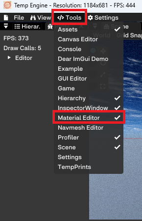
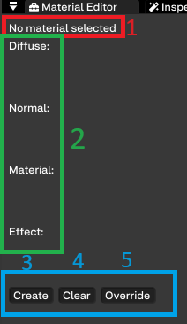
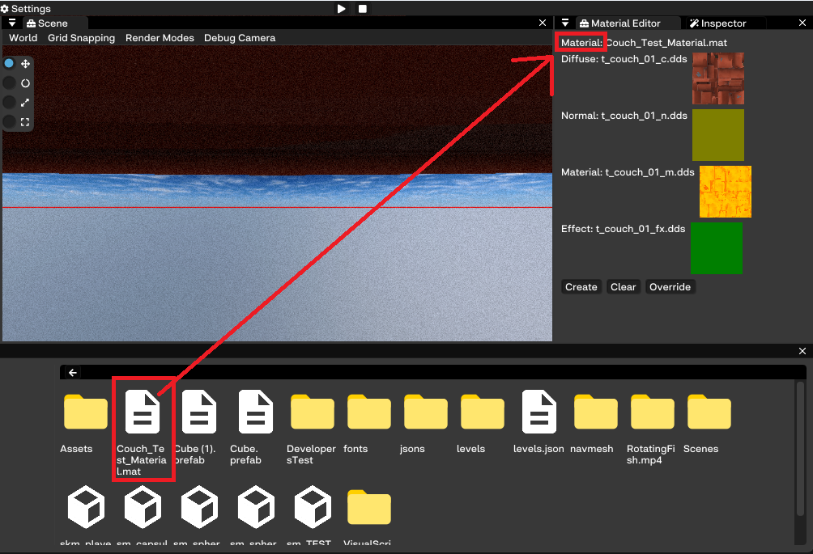
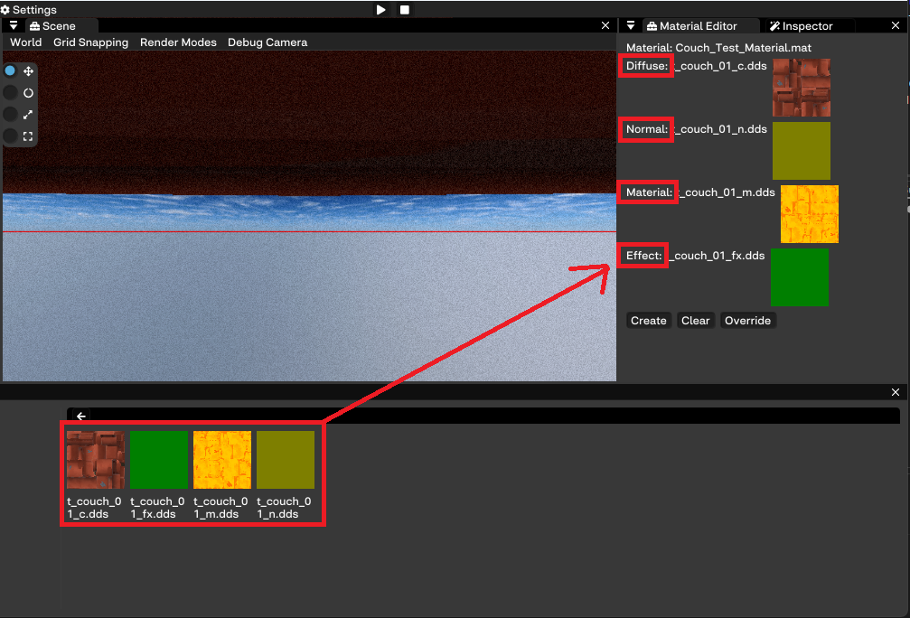

# Creating A Material

To create a material, use the Material Editor window.

Do the following to create a material:

1. Open the Material Editor Window found here:

In the window there are a few things: 

1. Starting from the top we find the name of the material. Here you can drag an existing material to edit or create a new one using the same textures.

2. Then we have the texture slots. When a texture is dragged and added, it will display the name and show the texture next to it.

3. At the bottom we have the create button. This button can be used to create the final material and store it at the desired location.
***At the moment its not recommended to delete a material after its been created, this because if the material is used on a model in*** **any** ***scene, the scene may not be able to load or crash.***

4. Beside the create button there's the clear button, this will clear the whole window including textures and material.

5. The last button is the override button, if a existing material has been added to the window the override button can override the material and it will automatically update.
***Note that right now it wont update on a model until after the application has been restarted***

### Drag Existing Material

### Drag Textures

