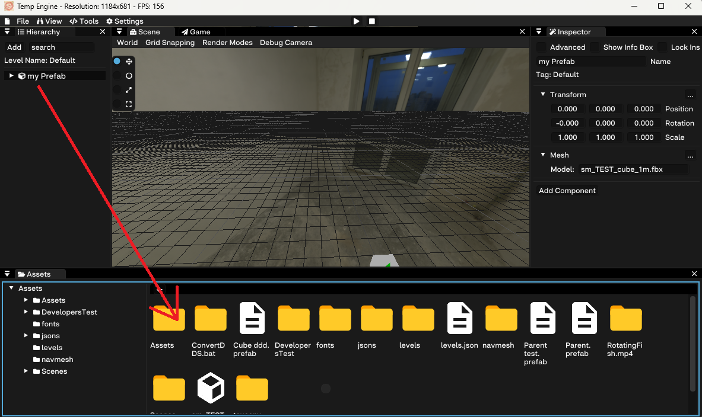
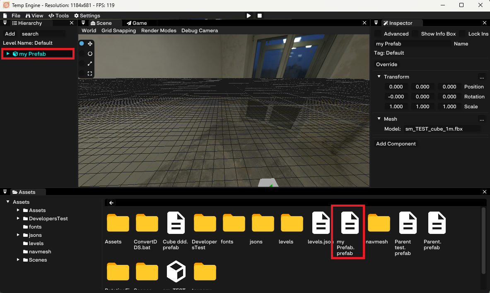

# Creating A Prefab

You can create a prefab by just draging it from the hierarchy to the assets window.
The prefab will be created in the current directory you see in the assets window.

The prefab name will turn blue in the hierarchy and it will be added to the assets window. 

